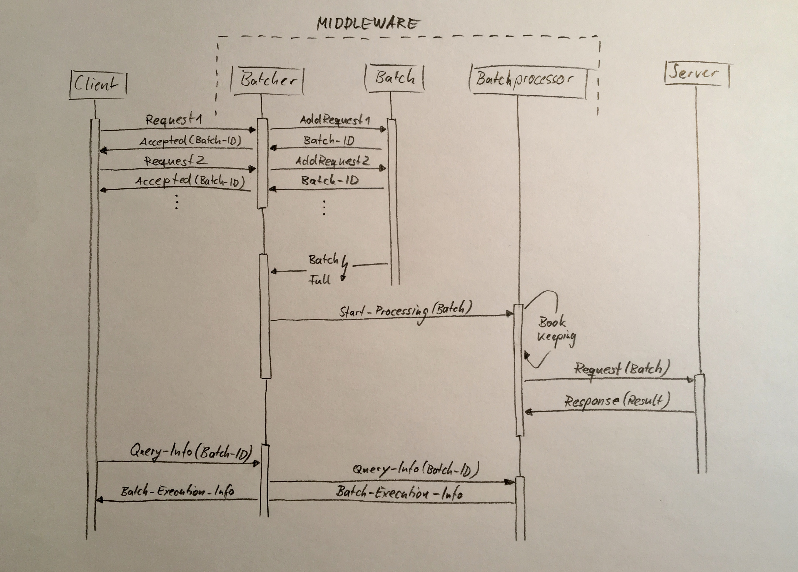

# Request Batcher

The request batcher is a collection of classes which serves as middleware. You can use them to execute a bunch of client requests in a single server request, either by specifying a number of requests per batch or by defining a time frame to accept requests to go into a single batch.
The managing and book keeping is done internally and can easily be extended to support persistence or scalability. A client can query batch-execution-information at a later point.
You can also imagine to implement a notification mechanism which allows the middle ware to inform clients about batch-execution-completion (e.g. webhooks).

